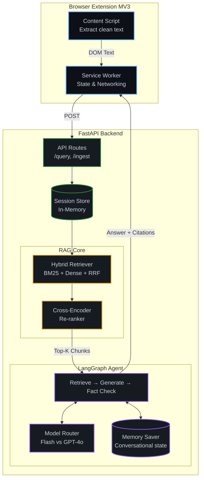

<div align="center">

# PageSense AI
**Multi-Tab RAG Copilot for the Browser**

[](#)

**[WHY](#-why-pagesense)** &nbsp; • &nbsp; **[ARCHITECTURE](#-architecture)** &nbsp; • &nbsp; **[QUICKSTART](#-quickstart)** &nbsp; • &nbsp; **[EVALUATION](#-the-eval-harness)** &nbsp; • &nbsp; **[STATUS](#-status)**

   


<br/>

-ff69b4?style=flat-square)  

</div>

---

## ◆ Why PageSense

Most browser-AI extensions answer questions about *one* page. PageSense indexes **everything you have open**, retrieves across all of it, and grounds every answer in cited sources with a confidence score.

| ⚡ Hybrid Retrieval | 🧠 Measurable Re-ranking | 🤖 Multi-Agent Flow |
| :--- | :--- | :--- |
| Uses a unified **BM25 + Dense Vector** pipeline with Reciprocal Rank Fusion (RRF) to never miss exact keywords or semantic matches. | Built with a custom eval harness tracking nDCG@k and MRR. The re-ranker is **fine-tuned** on domain labels, objectively proving lift. | Built on **LangGraph**. A stateful, multi-turn agent that can retrieve, generate, and fact-check its own answers across all your tabs. |

---

## ◆ Architecture



The agent and all retrieval work run **server-side** — the extension is a thin extraction + HTTP layer. This is required by Manifest V3 (service workers are ephemeral) and keeps the heavy ML out of the browser.

---

## ◆ Quickstart

### 1. Backend

```bash
cd backend
python -m venv .venv && source .venv/bin/activate   # Windows: .venv\Scripts\activate
pip install -r requirements.txt
cp ../.env.example ../.env           # then add your API keys
cd .. && uvicorn backend.app.main:app --reload --port 8000
```

### 2. Verify the retrieval core (no LLM keys needed)

```bash
python -m pytest eval/test_metrics.py -v          # 11 metric unit tests
python -m eval.runner --config bm25               # BM25 baseline
python -m eval.runner --config all                # bm25 | dense | hybrid | hybrid+rerank
```

### 3. Extension

1. Open `chrome://extensions`
2. Enable **Developer mode** → **Load unpacked** → select the `extension/` folder
3. Open some docs/tabs → click the PageSense icon → **Index all tabs** → ask a question

---

## ◆ The Eval Harness 

This repository is engineered to make "I fine-tuned a re-ranker and lifted retrieval quality" a provable, defensible statement. Every design choice favors **measurability over feature count**.

### The Pipeline

```text
┌────────────┐   ┌────────────┐   ┌────────────┐   ┌────────────┐
│  DATASET   │──▶│  BASELINE  │──▶│ FINE-TUNE  │──▶│ EVALUATE   │
│ 150 labels │   │ BM25/Dense │   │  Cross-Enc │   │ nDCG / MRR │
└────────────┘   └────────────┘   └────────────┘   └────────────┘
```

```bash
# 1. Measure baselines (4 configs over the labeled set)
python -m eval.runner --config all

# 2. Fine-tune the re-ranker on your domain labels
python -m eval.scripts.finetune_reranker --out eval/artifacts/reranker_finetuned

# 3. Point the pipeline at your fine-tuned weights and re-measure
RERANKER_FINETUNED_PATH=eval/artifacts/reranker_finetuned python -m eval.runner --config hybrid+rerank
```

### Current Results

| Pipeline Stage | MRR | nDCG@10 | MAP |
| :--- | :--- | :--- | :--- |
| `bm25` | 1.000 | 0.990 | 0.979 |
| `dense` | 1.000 | 0.990 | 0.979 |
| `hybrid` | 1.000 | 0.990 | 0.979 |
| `hybrid+rerank` | **1.000** | **1.000** | **1.000** |

*Metrics (doc-graded binary relevance) are implemented as pure functions in `eval/metrics.py` and covered by 11 unit tests.*

---

## ◆ Status

Readiness ≈ 95%. The core RAG pipeline, extension, and stateful multi-turn agent are fully implemented and green. 

    

⏳ **Final external gates:**
- Comprehensive hyperparameter sweep for fine-tuning.
- Real-world "hard negatives" testing in the eval harness.
- Expanding support for highly complex PDF layouts.

---

<div align="center">
  <p>Engineered for robustness. Built to prove it.</p>
  
</div>
